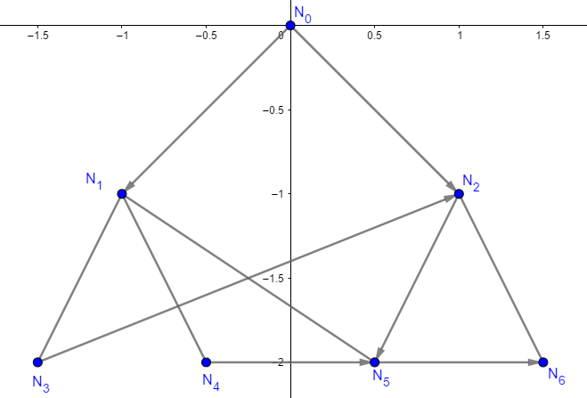

Parse A Graph
=====================

Graph-parsing is essential to CSPath. Version 1.0.0 offers two methods of parsing graphs.

Let :math:`m` denote the number of nodes in the graph. Helpful notation is introduced:

We use:

- :math:`n_{1} \parallel n_{2}`, if one cannot go from node :math:`n_{1}` to node :math:`n_{2}` by following only one edge.
- :math:`n_{1} \perp n_{2}`, if one can go from node :math:`n_{1}` to node :math:`n_{2}` by following one edge.

Note that:

1. :math:`n_{1} \parallel n_{2}` does not imply that :math:`n_{1}, n_{2}` do not share an edge and thereby :math:`n_{2} \parallel n_{1}`, as there could exist a directed edge from :math:`n_{2}` to :math:`n_{1}`.
2. :math:`n_{1} \perp n_{2}` does not imply :math:`n_{2} \perp n_{1}`, as the edge connecting the two could be directed from :math:`n_{1}` to :math:`n_{2}`.

Method 1: Using a Distance Matrix
---------------------------------

The distance function is defined as follows:

.. math::
    d_{a, b} = d(n_{a}, n_{b}) = 
                                 \left\{
                                        \begin{array}{ll}
                                              w(a, b) & \mbox{if } n_{a} \perp n_{b} \\
                                              +\infty & \mbox{if } n_{a} \parallel n_{b}
                                        \end{array}
                                 \right.
                                    
                                
, where :math:`w(a, b)` is the weight of the edge connecting nodes :math:`n_{a} \neq n_{b}`.  

As a convention, :math:`n_{0}` is the start node and :math:`n_{m-1}` is the end node.
The distance matrix is the square matrix with entries the values of the distance function in the following manner:

.. math::
    D =
        \begin{pmatrix}
              0          & d_{0, 1}   & d_{0, 2}     & ...    & d_{0, m-2}   & d_{0, m-1} \\
              d_{1, 0}   & 0          & d_{1, 2}     & ...    & d_{1, m-2}   & d_{1, m-1} \\
              d_{2, 0}   & d_{2, 1}   & 0            & ...    & d_{2, m-2}   & d_{2, m-1} \\
                         &            &              & \ddots &              &            \\
              d_{m-2, 0} & d_{m-2, 1} & d_{m-2, 2}   & ...    & 0            & d_{m-2, m-1} \\
              d_{m-1, 0} & d_{m-1, 1} & d_{m - 1, 2} & ...    & d_{m-1, m-2} & 0
        \end{pmatrix}
        
       
A consequence of the definition of the distance matrix and introduced notation is that :math:`d_{a, b} = d_{b, a}` is not necessarily true. This means that the distance matrix can describe any graph, be it directed or undirected.
In code, the distance matrix must always be of type :code:`numpy.array` and the first and last rows must correspond to the start and end nodes, respectively. 

To make things clearer, consider the graph below, which has both directed and undirected edges.

The code that parses this graph for use in CSPath is:

.. code-block:: python

    import numpy as np
    distance_matrix = np.array([[     0,       1,  np.inf,  np.inf,  np.inf,  np.inf,  np.inf,  np.inf], 
                                [     1,       0,     1.2,     1.3,     1.5,  np.inf,  np.inf,  np.inf],
                                [np.inf,     1.2,       0,  np.inf,     0.3,     1.1,  np.inf,  np.inf], 
                                [np.inf,     1.3,  np.inf,       0,     0.6,  np.inf,  np.inf,       2], 
                                [np.inf,  np.inf,  np.inf,  np.inf,       0,     0.1,     1.0,     1.1], 
                                [np.inf,  np.inf,     1.1,  np.inf,     0.1,       0,     0.5,  np.inf], 
                                [np.inf,  np.inf,  np.inf,  np.inf,       1,     0.5,       0,     0.7], 
                                [np.inf,  np.inf,  np.inf,  np.inf,     1.1,  np.inf,     0.7,       0],
                              ])

To denote :math:`n_{i} \parallel n_{j}`, one could always use :code:`-np.inf` instead of :code:`np.inf`. For certain algorithms, one could replace :code:`np.inf` by any negative real number. Both of these practices are not encouraged, as it is best to just use :code:`np.inf`.

Method 2: Using Cartesian Coordinates
-------------------------------------

If the nodes in the graph to be parsed are described via cartesian coordinates, CSPath offers functionality to do precisely that. Let us introduce some more notation: :math:`n_a = (x_a, y_a, z_a)` denotes node :math:`n_{a}` with coordinates :math:`(x_a, y_a, z_a)`. 

Adapted to this configuration, the distance function is defined as:

.. math::
    d_{a, b} = d(n_{a}, n_{b}) = 
                                 \left\{
                                        \begin{array}{ll}
                                              e(a, b) & \mbox{if } n_{a} \perp n_{b} \\
                                              +\infty & \mbox{if } n_{a} \parallel n_{b}
                                        \end{array}
                                 \right.
                                    
                                
, where :math:`e(a, b)` is the euclidean distance from node :math:`n_a` to node :math:`n_b`. 

There is no need to explicitly define a distance matrix. The parsing mainly includes two functions from the `Source`_: :code:`cspath.Graph.addNode, cspath.Graph.linkNodes`. The only specifications for this type of parsing are that the start node must be defined first and the end node must be defined last. 

For clarity, assume that the following graph is to be parsed:

The code that parses this graph for use in CSPath is:

.. code-block:: python

    from cspath import Graph
    
    g = Graph()
    
    n0 = g.addNode(0, 0, 0)
    n1 = g.addNode(-1, -1, 0)
    n2 = g.addNode( 1, -1, 0)
    n3 = g.addNode(-1.5, -2, 0)
    n4 = g.addNode(-0.5, -2, 0)
    n5 = g.addNode(0.5, -2, 0)
    n6 = g.addNode(1.5, -2, 0)
    
    g.linkNodes(n0, n1, False)
    g.linkNodes(n0, n2, False)
    g.linkNodes(n1, n3, True)
    g.linkNodes(n1, n4, True)
    g.linkNodes(n1, n5, True)
    g.linkNodes(n2, n5, False)
    g.linkNodes(n2, n6, True)
    g.linkNodes(n3, n2, False)
    g.linkNodes(n4, n5, False)
    g.linkNodes(n5, n6, False)
    

.. _Source: https://cspath.readthedocs.io/en/latest/reference/source.html
